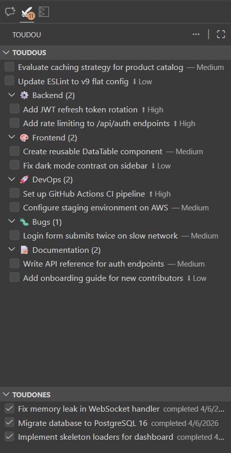

# Toudou

  

A workspace-scoped todo list living right in your VS Code sidebar. Organize tasks with categories, priorities, drag & drop, and full undo/redo — no cloud, no account, everything stays local.

## Features

### Todos

- **Add, complete, delete and restore** todos from the sidebar or the Command Palette
- **Priorities** — high, medium, low — shown as inline labels and sortable
- **Descriptions** — optional details visible in tooltips
- **Checkbox integration** — check to complete, uncheck to restore
- **Double-click** a todo to rename it instantly

### Categories

- Create, rename, and delete categories
- Assign an **emoji** to each category
- Move todos between categories via the context menu or drag & drop

### Drag & Drop

- Reorder todos within a category
- Move todos between categories or to/from uncategorized
- Reorder categories themselves

### Sorting

Four sort modes available from the title bar:

| Mode                    | Description                                    |
| ----------------------- | ---------------------------------------------- |
| **Manual**              | Your own ordering via drag & drop              |
| **Priority**            | Flat list, highest priority first              |
| **Category**            | Grouped by category, manual order inside       |
| **Category + Priority** | Grouped by category, sorted by priority inside |

### History (Toudones)

Completed todos are moved to the **Toudones** panel where you can restore them individually or purge them all.

### Undo / Redo

Every action is undoable (up to 50 states). Keyboard shortcuts:

- **Undo**: `Ctrl+Z` / `Cmd+Z` (when panel is focused)
- **Redo**: `Ctrl+Shift+Z` / `Cmd+Shift+Z`

### Export / Import

- **Export** your todos (or a selection) to a JSON file
- **Import** from a JSON file — categories are auto-created as needed
- File size capped at 5 MB for safety

### Filter

Search todos by title or description in both panels.

### In Progress

Mark a todo as "in progress" — it gets a green icon to show what you're actively working on.

### Copilot Integration

Right-click a todo and select **Open in Copilot** to start a chat session with the task context pre-filled. The todo gets a green "in progress" icon while you work on it.

Six **Language Model Tools** are also registered so Copilot can create, list, complete, delete todos and manage categories on your behalf.

### Storage

- Data is stored **per workspace** in VS Code's `workspaceStorage` — never in your repo
- Configurable storage path via settings or per-workspace override
- Inspect the raw JSON anytime with **Toudou: Open Storage File**

### Localization

Fully translated in **English** and **French**. VS Code picks the right language automatically.

## Commands

All commands are available under the **Toudou** category in the Command Palette (`Ctrl+Shift+P`):

| Command                    | Description                                                |
| -------------------------- | ---------------------------------------------------------- |
| Add Todo                   | Create a new todo (with optional category and description) |
| Complete Todo              | Mark a todo as done                                        |
| Delete Todo                | Permanently remove a todo                                  |
| Create Category            | Add a new category                                         |
| Rename Category            | Rename an existing category                                |
| Delete Category            | Remove a category (todos become uncategorized)             |
| Restore from Toudones      | Bring back a completed todo                                |
| Purge Toudones             | Delete all completed todos                                 |
| Change Priority            | Set priority on a todo                                     |
| Filter Todos               | Search in the todo list                                    |
| Export Todos               | Export todos to a JSON file                                |
| Import Todos               | Import todos from a JSON file                              |
| Open Storage File          | View the raw JSON data                                     |
| Set Workspace Storage Path | Override the storage location for this workspace           |
| Reload Storage File        | Re-read the storage file from disk immediately             |

## Settings

| Setting                        | Description                                                                                  |
| ------------------------------ | -------------------------------------------------------------------------------------------- |
| `toudou.defaultStoragePath`    | Default path to the storage file. Use `{workspace}` as a placeholder for the workspace name. |
| `toudou.defaultAddMode`        | Which flow the `+` button runs: `quick` (title only) or `complete`. Default: `quick`.        |
| `toudou.watchExternalChanges`  | Reload the storage file when another app edits it. Default: `true`.                          |
| `toudou.watchIntervalSeconds`  | How often the file is checked for external changes: 2, 3, 5 or 10. Default: `3`.             |

`toudou.defaultStoragePath` is **machine-scoped**: it can only be set in your user or remote settings, never by a workspace, since it decides where the extension writes. In a remote window (WSL, SSH, Codespaces) the Settings editor lists it under the **Remote** tab rather than **User** — the machine it applies to is the remote one, and a path means something different on each side.

The three other settings are **application-scoped**: they live in your user settings only, shared by every window, and no workspace can change them.

To point one project at a different file, use the **Toudou: Set Workspace Storage Path** command rather than a workspace setting: it stores the override outside the project, so cloning a repository never changes where your todos are written.

By default, Toudou stores its data in VS Code's `workspaceStorage` directory, completely outside your project. You can override this with `toudou.defaultStoragePath`:

- **Relative path** — resolved from the workspace root (e.g. `.vscode/toudou.json`). Must stay inside the workspace.
- **Absolute path** — any location on disk (a warning is shown once per path).
- **`~`** — expanded to your home directory.
- **`{workspace}` placeholder** — replaced with a sanitized version of the workspace folder name (e.g. `~/.toudou/{workspace}.json`).

You can also set a **per-workspace** path via the command **Toudou: Set Workspace Storage Path**, which takes precedence over the global setting.

### First use in a workspace

The first time you open the Toudou view in a project that has no todos yet, Toudou asks where they should live:

| Choice | Result |
| ------ | ------ |
| **Create in workspace** | `.vscode/toudou.json`, next to the project and committable if you want it to be |
| **Choose location…** | a save dialog: pick the folder and the file name yourself |
| **Use an existing file…** | point at a file you already have, typically the one shared with Obsidian |
| **Don't ask again** | keeps the invisible default in `workspaceStorage` |

The answer is stored per workspace, outside the project. Dismissing the notification is not an answer — the question comes back next time.

## Sharing the storage file

The storage file can be shared with the [Obsidian Toudou plugin](https://github.com/Sillot/obsidian-toudou), another VS Code window, or another machine through a synced folder (Synology Drive, OneDrive…) — the on-disk format is identical.

Every change is applied on top of a fresh read of the file and saved through a temporary file renamed into place, so a write never rests on a stale copy and a reader never sees a half-written file. Anything Toudou does not recognize — keys or entries written by another client — is preserved as-is instead of being dropped on the next save. External changes appear in the tree within a few seconds without reloading the window; **Toudou: Reload Storage File** forces an immediate re-read.

Two windows on the same machine are serialized by that read-modify-write, so neither loses the other's edit. Across machines the last writer still wins: the sync client, not Toudou, decides which revision lands, and a simultaneous edit on both ends may produce a conflict copy.

## Development

Open in VS Code with Dev Containers to get the full dockerized dev environment.

### Scripts

| Script              | Description                                            |
| ------------------- | ------------------------------------------------------ |
| `npm run compile`   | Build the extension                                    |
| `npm run watch`     | Build in watch mode                                    |
| `npm run typecheck` | Run TypeScript type checking                           |
| `npm run lint`      | Run ESLint                                             |
| `npm run format`    | Format with Prettier                                   |
| `npm test`          | Run the storage unit tests                             |
| `npm run check`     | Run typecheck + lint + format check + tests            |
| `npm run package`   | Package as `.vsix` (runs check + minified build first) |

### Debug

Press `F5` to launch an Extension Development Host with the extension loaded.

## Contributing

Contributions are welcome! Whether it's a bug fix, a feature suggestion, or a documentation improvement — feel free to open an issue or submit a pull request.

## License

[MIT](LICENSE)
